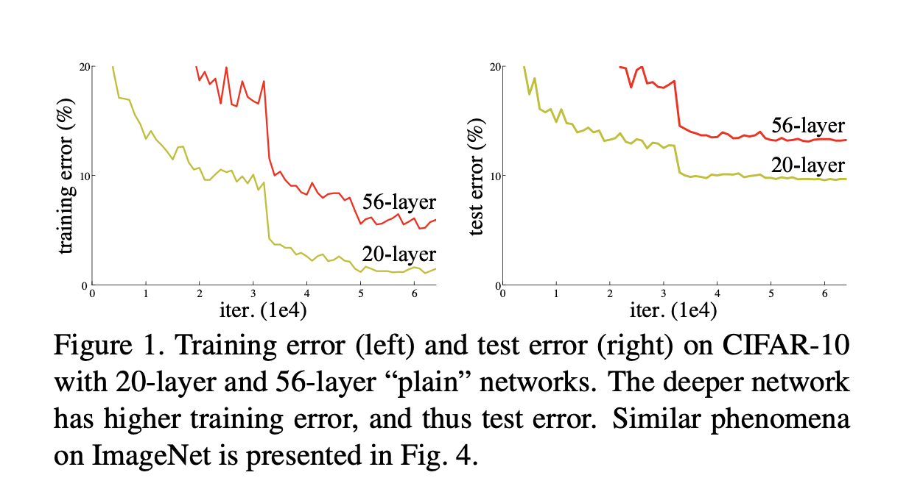

# Deep residual learning for image recognition

## Overview 

### The Problem
The introduction has an interesting question - **Is learning better networks as easy as stacking more layers?** The answer seems to by a "yes". If we have a model, and it's giving a good result. It's expected that when we increase the layers, the performance will become better. So, if we train a 20 layer model, and a 56 layer model (VGG type model), it is expected that the 56 layer model will perform better. But, the experiments suggest otherwise - 

In the above figure, we can see that the 56 layered networking is performing worse than the 20 layered network. 

### The reason for the problem 
The statements "An obstacle to answering this question was the notorious problem of vanishing/exploding gradients [1, 9], which hamper convergence from the beginning. This problem, however, has been largely addressed by normalized initial- ization [23, 9, 37, 13] and intermediate normalization layers [16], " and "Unexpectedly, such degradation is not caused by overfitting, and adding more layers to a suitably deep model leads to higher train- ing error, as reported in [11, 42] and thoroughly verified by our experiments" mentions that the issue for this degradation is not vasnishing / exploding gradints, or even overfitting. The degradation happens because the model is not able to optimise for larger number of layers. 

### An intuition to the solution of the problem 
Instead of learning the transformation from input to layer, we force the model to learn the residuals. Ie, difference between the output and input. So, if there is no or less difference between the input and output, instead of learning the identity transformation, the model will now learn zero transformation (which is easier). 

## Different types of projection shortcuts 

## Some other points - 

- Unlike VGG, Resnet doesn't uses Fully connected layers at the classification end. Due to this, even Resnet has very less FLOP's as compared to VGG. 34 layered Resnet has 5 times less number of parameters as compared to VGG-19 (19 layered).

  
