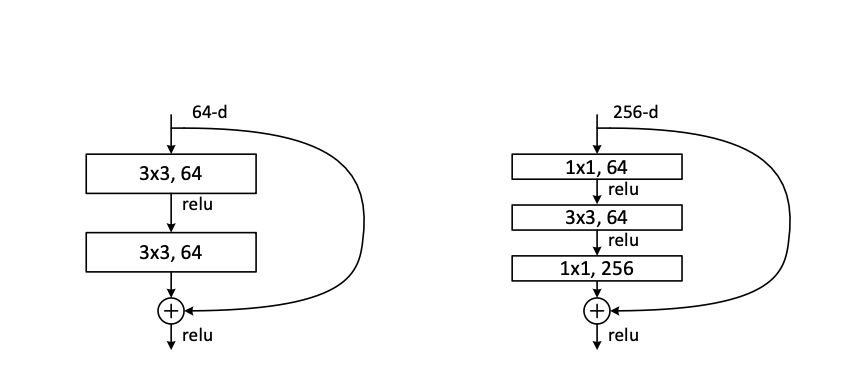

# Deep residual learning for image recognition

## Overview 

### The Problem
The introduction has an interesting question - **Is learning better networks as easy as stacking more layers?** The answer seems to by a "yes". If we have a model, and it's giving a good result. It's expected that when we increase the layers, the performance will become better. So, if we train a 20 layer model, and a 56 layer model (VGG type model), it is expected that the 56 layer model will perform better. But, the experiments suggest otherwise - 

In the above figure, we can see that the 56 layered networking is performing worse than the 20 layered network. 

### The reason for the problem 
The statements "An obstacle to answering this question was the notorious problem of vanishing/exploding gradients [1, 9], which hamper convergence from the beginning. This problem, however, has been largely addressed by normalized initial- ization [23, 9, 37, 13] and intermediate normalization layers [16], " and "Unexpectedly, such degradation is not caused by overfitting, and adding more layers to a suitably deep model leads to higher train- ing error, as reported in [11, 42] and thoroughly verified by our experiments" mentions that the issue for this degradation is not vasnishing / exploding gradints, or even overfitting. The degradation happens because the model is not able to optimise for larger number of layers. 

### An intuition to the solution of the problem 
Instead of learning the transformation from input to layer, we force the model to learn the residuals. Ie, difference between the output and input. So, if there is no or less difference between the input and output, instead of learning the identity transformation, the model will now learn zero transformation (which is easier). 

## Different types of projection shortcuts 

In each block of resnet where skip connection is used, the final output is the block output + the block input. For the addition to take place, the block output and the block input should have same dimensions. Although, in most cases it would be the case that the shape of the output will be different than the input. Usually, the output feature map have smaller spatial dimension, but larger number of channels as compared to the input. In this case, we project the input feature maps to have same dimension as output feature maps, so that we can add them up. The paper mentions 3 ways of doing it :- 

- A: (parameter free) Copy in input as it is, and add 0's in the remaining place. For example, if the input is of share (56, 56, 128) and output is of shape (28,28,256), then first the input is downsampled to (28, 28, 128), and then 0s are added to make if of the shape (28, 28, 256).
- B: (uses parameters) If the dimensions are same, then pass it as it is. Otherwise, use 1x1 convolution to decrease the spatial size (by using stride=2), and also to increase the dimensions (by controlling the number of kernels used).
- C: Doesn't matter is the size is equal or not, always use 1x1 colvolution.
  
## Some other points - 

- Unlike VGG, Resnet doesn't uses Fully connected layers at the classification end. Due to this, even Resnet has very less FLOP's as compared to VGG. 34 layered Resnet has 5 times less number of parameters as compared to VGG-19 (19 layered).

  
